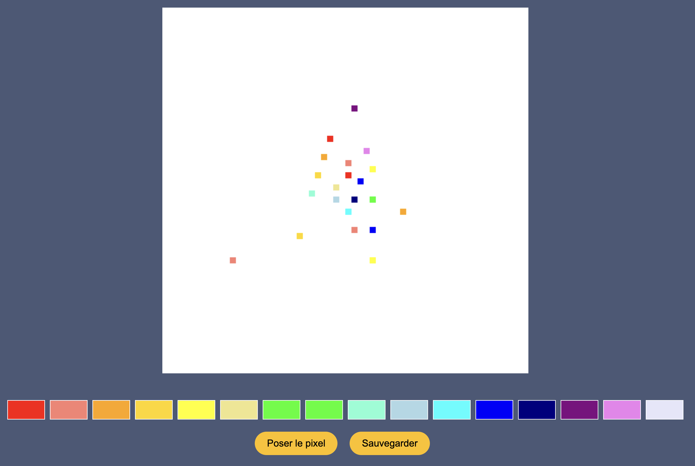
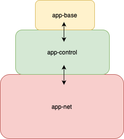
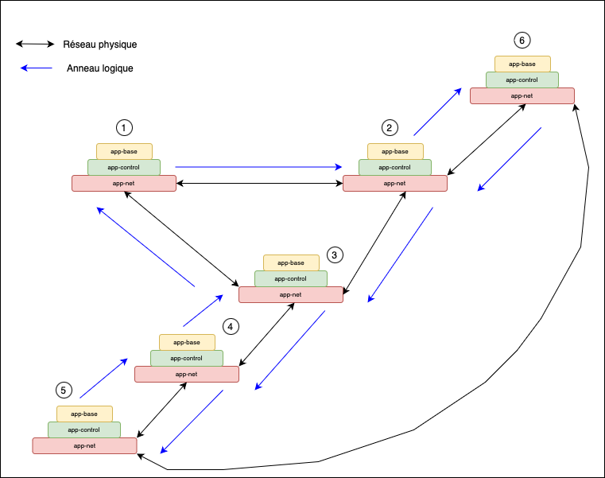
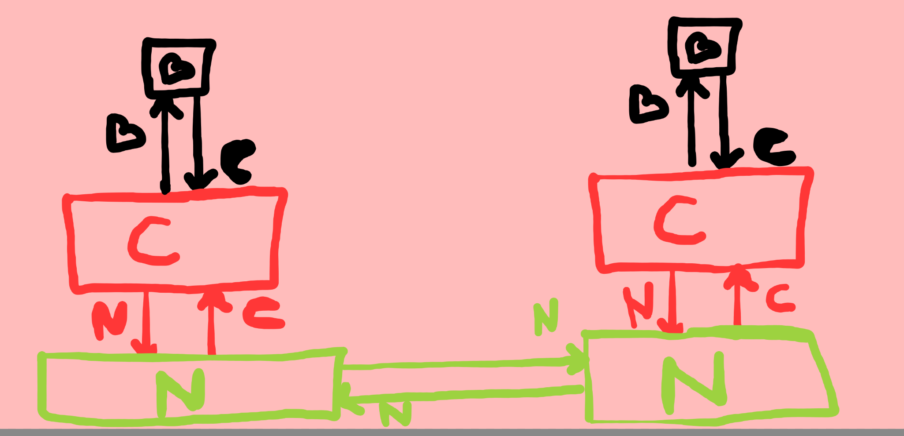
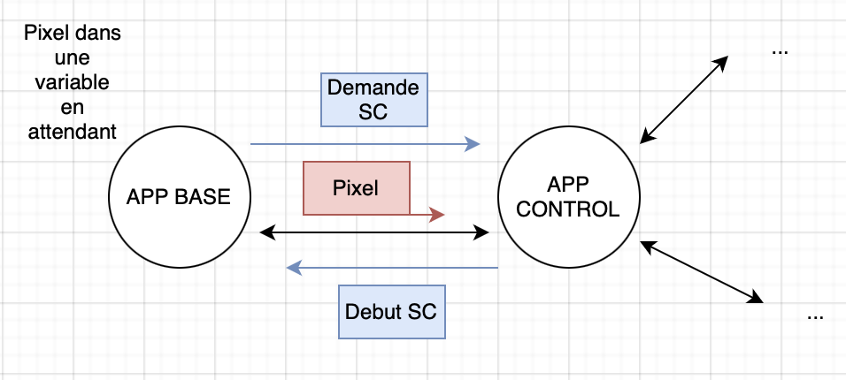

# <span style="color: blue;">P</span><span style="color: red;">I</span><span style="color: black;">X</span><span style="color: yellow;">E</span><span style="color: purple;">L</span><span style="color: orange;">-</span><span style="color: grey;">W</span><span style="color: pink;">A</span><span style="color: green;">R</span>

## Introduction



### Concept

Chaque joueur a devant lui une grille de pixels partagée par tous les joueurs. 
Il peut placer les pixels par couleur sur cette grille en sélectionnant une couleur, en choisissant la position et en appuyant sur le bouton dédié. 
Après avoir colorié un pixel, il doit attendre un certain nombre de secondes (10 par défault) avant de pouvoir en colorier un autre.

**Le but ? Réussir à dessiner des motifs sans que les autres utilisateurs nous en empêchent**

### Une architecture spécifique : Le système réparti

L'application est répartie sur les différents sites, correspondant à autant d'utilisateurs.
La donnée partagée est la grille de pixels (en effet, chaque instance de site possède sa propre copie de la donnée).
Dès lors qu'un joueur pose un pixel, ce pixel est partagé aux autres sites, et apparaît donc sur la grille des autres joueurs.
Cette mise à jour ainsi que l'ensemble des autres fonctionnalités réparties de l'application reposent sur un système de communication dont le protocole est propre à l'application répartie.

## Technologies utilisées

Le système réparti sur lequel se base l'application repose sur l'implémentation d'algortihmes de répartis tels que le calcul d'instantané, la file d'attente répartie, l'élection par vague, etc.

Ce projet est devéloppé en Go pour tout le fonctionnement des sites puis en JavaScript/HTML pour les interfaces graphiques.

## Architecture

### Organisation d'un site




Un site est divisé en trois processus distincts qui communiquent entre eux : l'application de base, l'application de contrôle et l'application network.
**L'application de base** gère l'interface graphique du jeu, c'est elle qui réagit aux actions de l'utilisateur.
**L'application de contrôle** s'occupe du fonctionnement des algorithmes répartis intrinsèquement liés aux fonctionnalités de l'application : sauvegarde et exclusion mutuelle.
**L'application de network (app-net)** s'occupe de gérer la robustesse des algorithmes sur toute topologie, notamment lors de l'ajout ou du départ d'un site (dynamisme du réseau).

### Structure du réseau




Dans la figure ci-dessus, la numérotation permet de distinguer les sites entre eux mais n'implique rien de spécifique concernant un ordre d'envoi de messages ou autre.
De même, la figure ci-dessus permet de visualiser ce à quoi peut ressembler un réseau pour cette application mais il ne s'agit que d'un exemple, toute autre topologie physique est également possible, tant que celle-ci est connexe.
Dans cet ensemble de sites interconnectés, nous distinguons 2 réseaux : **un réseau physique** dont la topologie peut être quelconque avec des communications bidirectionnelle puis un **réseau logique** artificiel en anneau unidirectionnel.
En ce sens, la couche app-net permet aux applications plus haut niveau de faire abstraction de la topologie et de fonctionner normalement.
Cette abstraction est réalisée à l'aide d'un système de routage : partout et à tout moment, un site ne se situe qu'à un seul endroit sur l'anneau qu'il détermine lui seul. 
Lors de l'arrivée ou du départ d'un site, la table de routage est mise à jour en conséquence.


### Structure des messages

Sur le réseau, la communication est réalisée uniquement par l'envoi de chaines de caractère.
À l'intérieur des sites, nous utilisons des structures de données (*utils/types.go*) qui nous permettent de manipuler plus facilement les messages et ce qu'ils contiennent.
Ainsi, nous avons écrit des fonctions de formatage (*utils/format.go*) afin de passer du format chaîne de caractères à celui de structure organisée, et vice-versa.

Les pixels sont représentés par le type **MessagePixel**, avec leur position sur la grille et leur couleur codée en RGB.
Les apps de contrôle s'envoient entre elles des messages de contrôle représentés par le type **Message**.
Ces messages contiennent un **MessagePixel** ainsi que plusieurs informations sur le site qui les envoient, comme son nom, sa couleur et son horloge vectorielle (utiles pour la sauvegarde).
Un champ booléen *prepost* permet de marquer un message comme étant un message prépost.
Un message classique a donc ce champ placé à *false*.
Dans le but de pouvoir être robuste et ce, peu importe la topologie, l'app-net se contente de wrapper les messages de contrôle dans des messages de type **MessageNet**.
Elle ne fait qu'émettre et recevoir ces messages en prenant des décisions de routage.
Les app-net manipulent également des messages qui ne transitent pas uniquement selon l'anneau unidirectionnel : 
Il s'agit des messages liés au dynamisme du réseau : les messages liés à l'élection d'un membre pour l'ajout ou le départ d'un autre (**MessageVague**) puis les messages liés au raccordement/dé-raccordement lui-même (**MessageRaccord**).

Afin de distinguer les types d'applications censées traiter (ou non) les messages reçus, nous utilisons les prefixes suivants :




## Cohérence des réplicats : algorithme d'exclusion mutuelle



### Concept

Afin de garantir la cohérence des réplicats, une seule modification à la fois n'est autorisée.
Cette modification est ensuite propagée aux autres réplicats.

Nous avons pour cela implémenté **l'algorithme de la file d'attente répartie** que nous avons dû adapter à notre structure en anneau logique.
Dans cette application, une exclusion mutuelle était nécessaire uniquement pour **l'écriture** de la donnée partagée.

### Fonctionnement

Lorsqu'un site souhaite ajouter un pixel sur la carte, il effectue d'abord une demande à son application de contrôle qui vérifie et fait inscrire cette demande auprès des autres utilisateurs.
Pendant ce temps là, l'ajout est en attente.
Si sa demande est la plus ancienne (ceci est calculé grâce aux estampilles (numéro de site et horloge) des sites), il obtient l'autorisation d'accès.
Sinon, chaque site le catégorise comme demandeur et enregistre son horloge pour lui donner priorité la fois suivante.

Lorsqu'un site entre en section critique, il est alors autorisé à modifier le pixel escompté et à diffuser ce pixel au reste du réseau.
Immédiatement après avoir envoyé ce pixel, le site demandeur prévient les autres sites qu'il a terminé via un message de libération.
Sur le chemin, chaque site reçoit le pixel et puis le transmet, ainsi que le message de libération. 

Si par hasard un site avait demandé l'accès à la section critique pendant que le premier site l'avait, alors la recéption de ce message de libération lui donnera l'accès.
Si plusieurs sites sont dans ce cas, le premier à avoir demandé l'accès sera privilégié, les autres devront attendre leur tour dans l'ordre.

## Sauvegarde : algorithme de calcul d'instantané

### Concept

Nous avons implémenté un système de sauvegarde dans l'application.
Une app de base peut envoyer le message *sauvegarde* à son app de contrôle, ce qui lance alors une sauvegarde globale.
Pour cela, nous utilisons un **algorithme de lestage avec reconstitution de configuration**.
Le site initiateur de la sauvegarde construit un état global du système, représenté par le type **EtatGlobal**.
Cet état global contient une liste d'états locaux, il y en a autant qu'il y a de sites sur le réseau.
Il contient également une liste de messages préposts.

### Fonctionnement

Lorsqu'un site est prévenu de la sauvegarde, sa couleur passe de *Blanc* à *Jaune*.
Il envoie alors son état local sur l'anneau pour que le site initiateur le reçoive.
L'état local, représenté par le type **EtatLocal**, contient le nom du site, son horloge vectorielle, ainsi qu'une liste de **MessagePixel**.
Cette liste est mise à jour dès qu'un nouveau pixel est ajouté sur la grille.
Lorsque la sauvegarde est demandée, il suffit alors de l'envoyer dans un **MessageEtat** contenant l'état local.

Si un site sur l'anneau envoie un message après le début de la sauvegarde, mais avant d'être prévenu qu'une sauvegarde a été lancée, on obtient un message prépost.
Ce message va être identifié comme prépost par le premier site Jaune sur lequel il va arriver.
Il sera ensuite redirigé jusqu'à l'initiateur de la sauvegarde pour être ajouté à l'état global.

Étant donné que les communications sont FIFO sur l'anneau logique, nous n'avons pas besoin de vérifier que tous les messages préposts sont arrivés.
En effet, par définition, un message prépost envoyé par un site le sera toujours avant l'envoi du message état de ce site.
Ainsi, l'initiateur peut être sûr qu'il recevra les messages préposts d'un site avant son message état, car aucun message ne peut en doubler un autre (FIFO).
Il suffit donc à l'initiateur de compter le nombre d'états qu'il reçoit.
Lorsqu'il les a tous reçus, il peut considérer que la sauvegarde est terminée.
*Cela suppose qu'il connait à l'avance le nombre de sites présents sur le réseau.*
Une fois la sauvegarde terminée, il vérifie grâce aux horloges vectorielles que la coupure est cohérente.

## Adaptation à toute topologie : une table de routage maintenue

Dans le but de faire fonctionner l'envoi de pixels, la sauvegarde et l'exclusion mutuelle sur toutes les topologies connexes existantes : nous maintenons une table de routage sur chaque site.
Cette table de routage est donnée à chaque site lors de son lancement ce qui donne au tout départ un anneau logique fixé.
Par la suite, lorsqu'un site rejoint le réseau et se fixe sur un (ou plusieurs) autre(s) site(s), la table de routage du site receveur (celui qui est élu pour l'ajout) est ainsi mise à jour.
Pour un départ, c'est la même chose.

_Exemple sur le réseau présenté plus haut dans la partie "Structure du réseau" :_

_Les règles de la table de routage du site n°2 sont les suivantes : 1->6 | 6->3. 
Ce qui signifie que les messages en provenance de 1 doivent transiter (si nécessaire) vers 6 et ceux de 6 vers 3.
Cela signifie également que le site n°2 se place lui-même sur l'anneau entre 1 et 6 (car par convention, il ne traite que les messages en provenance de 1 et se contente de transmettre les autres).
Enfin, imaginons l'arrivée d'un site n°7 auprès du site n°2 avec une demande de raccordement : par convention, le site n°2 "casse" sa règle 0 en 2 nouvelles règles dont les destinations et origines deviennent égales au numéro du site arrivant.
Sur l'anneau logique, le site n°2 vient donc placer le voisin 7 entre 2 et 6. La table de routage du site n°2 devient alors la suivante : **1->7 | 7->6** | 6->3._


## Réseau dynamique (ajouts et départs pendant l'exécution) : algorithme d'élection par vague et raccordement

Lorsqu'un site souhaite rejoindre le réseau en cours d'exécution ou le quitter, il réalise une demande de raccordement auprès d'un site déjà actif. 
Celui-ci utilise le réseau physique bidirectionnel via les applications net présentes pour lancer une vague de messages.
Dans le cas d'une double vague (2 sites décident de rejoindre ou quitter le réseau en même temps), la vague dont le site initiateur aura le plus petit numéro sera privilégiée et la suivante échouera avant de retenter quelques secondes après.
Lorsque le site est élu (terminaison de la vague), il diffuse des messages appelés "messages verts" pour apporter l'information de l'ajout/départ du site, permettant aux autres sites de mettre à jour leurs variables et la taille de leur file d'attente répartie.
Pour cela, chaque applications net qui reçoit un message vert envoie un message très spécifique à son application de contrôle pour lui signifier les changements à effectuer.
Comme expliqué au dessus, dans l'application net, la table de routage est également mise à jour.

## Organisation du projet

Le dossier *utils* contient tous les types et fonctions de service nécessaires au fonctionnement de l'app de base et de l'app de contrôle.
Le dossier *app-net* contient le code de l'app net.
Le dossier *app-control* contient le code de l'app de contrôle.
Le dossier *app-base* contient le code de l'app de base.

Différents scripts reprenant la topologie donnée en exemple plus haut sont proposés. Ils mettent surtout en œuvre des ajouts et départs de sites.

Le script *nettoyage.sh* permet de supprimer les fichiers créés par le script précédent ainsi que de kill les processus lancés en tâche de fond.

## Utilisation

### Mode graphique

```
sh [nom_du_script_a_lancer]
```

### Nettoyage

```
sh nettoyage.sh
```