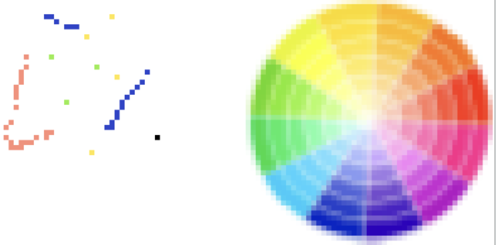
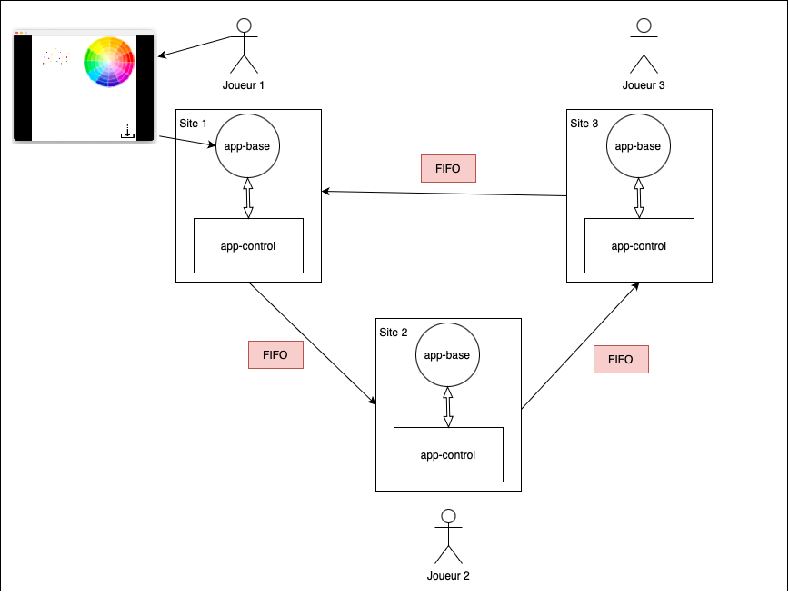

# Pixel War

## Introduction



### Concept

Chaque joueur a devant lui une grille de pixels partagé par tous les joueurs. 
Il peut placer des couleurs sur cette grille. 
Pour cela, il choisit une couleur sur une roue de couleurs, puis l'applique sur un pixel en cliquant dessus.
Après avoir colorié un pixel, il doit attendre un certain nombre de secondes (10 par défault) avant de pouvoir en colorier un autre.

**Le but ? Réussir à dessiner des motifs sans que les autres utilisateurs nous en empêchent**

### Système réparti

L'application est répartie sur les différents sites, correspondant à autant d'utilisateurs.
La donnée partagée est la grille de pixels (en effet, chaque instance de site possède sa propre copie de la donnée).
Dès lors qu'un joueur pose un pixel, ce pixel est partagé aux autres sites, et apparaît donc sur la grille des autres joueurs.
Cette mise à jour ainsi que l'ensemble des autres fonctionnalités réparties de l'application reposent sur un système de communication dont le protocole est propre à l'application répartie.


## Architecture




### Organisation d'un site

Un site est divisé en deux entités distinctes qui communiquent entre elles : l'app de base et l'app de contrôle.
L'app de base gère l'interface graphique du jeu, c'est elle qui réagit aux actions de l'utilisateur.
L'app de contrôle s'occupe du bon fonctionnement des algorithmes répartis.

### Structure du réseau

Dans notre application, nous utilisons un réseau en anneau avec des communications FIFO.
Chaque app de contrôle est reliée à son app de base avec un communication bidirectionnelle.
Les apps de contrôle forment entre elles un anneau unidirectionnel.

### Structure des messages

Sur le réseau, la communication est réalisée uniquement par l'envoi de chaines de caractère.
À l'intérieur des sites, nous utilisons des structures de données (*utils/types.go*) qui nous permettent de manipuler plus facilement les messages et ce qu'ils contiennent.
Ainsi, nous avons écrit des fonctions de formatage (*utils/format.go*) afin de passer du format chaîne de caractères à celui de structure organisée, et vice-versa.

Les pixels sont représentés par le type **MessagePixel**, avec leur position sur la grille et leur couleur codée en RGB.
Les apps de contrôle s'envoient entre elles des messages de contrôle représentés par le type **Message**.
Ces messages contiennent un **MessagePixel** ainsi que plusieurs informations sur le site qui les envoient, comme son nom, sa couleur et son horloge vectorielle (utiles pour la sauvegarde).
Un champ booléen *prepost* permet de marquer un message comme étant un message prépost.
Un message classique a donc ce champ placé à *false*.

Lorsqu'une app de contrôle envoie un message, elle l'envoie aux deux apps avec lesquelles elle a un arc sortant : son app de base et l'app de contrôle suivante sur l'anneau.
Afin de différencier les messages destinés à une app de contrôle de ceux destinés à un app de base, nous ajoutons le caractère *A* au début des seconds.

## Cohérence des réplicats : algorithme d'exclusion mutuelle


### Concept

Afin de garantir la cohérence des réplicats, une seule modification à la fois n'est autorisée.
Cette modification est ensuite propagée aux autres réplicats.

Nous avons pour cela implémenté **l'algorithme de la file d'attente répartie** que nous avons dû adapter à notre structure en anneau.
Dans notre application, une exclusion mutuelle était nécessaire uniquement pour **l'écriture** de la donnée partagée.

### Fonctionnement

Lorsqu'un site souhaite ajouter un pixel sur la carte, il effectue d'abord une demande à son application de contrôle qui vérifie et fait inscrire cette demande auprès des autres utilisateurs.
Pendant ce temps là, l'ajout est en attente.
Si sa demande est la plus ancienne (ceci est calculé grâce aux estampilles (numéro de site et horloge) des sites), il obtient l'autorisation d'accès.
Sinon, chaque site le catégorise comme demandeur et enregistre son horloge pour lui donner priorité la fois suivante.

Lorsqu'un site entre en section critique, il est alors autorisé à modifier le pixel escompté et à diffuser ce pixel au reste du réseau.
Immédiatement après avoir envoyé ce pixel, le site demandeur prévient les autres sites qu'il a terminé via un message de libération.
Sur le chemin, chaque site reçoit le pixel et puis le transmet, ainsi que le message de libération. 

Si par hasard un site avait demandé l'accès à la section critique pendant que le premier site l'avait, alors la recéption de ce message de libération lui donnera l'accès.
Si plusieurs sites sont dans ce cas, le premier a avoir demandé l'accès sera privilégié, les autres devront attendre leur tour dans l'ordre.

## Sauvegarde : algorithme de calcul d'instantané

### Concept

Nous avons implémenté un système de sauvegarde dans notre application.
Une app de base peut envoyer le message *sauvegarde* à son app de contrôle, ce qui lance alors une sauvegarde globale.
Pour cela, nous utilisons un **algorithme de lestage avec reconstitution de configuration**.
Le site initiateur de la sauvegarde construit un état global du système, représenté par le type **EtatGlobal**.
Cet état global contient une liste d'états locaux, il y en a autant qu'il y a de sites sur le réseau.
Il contient également une liste de messages préposts.

### Fonctionnement

Lorsqu'un site est prévenu de la sauvegarde, sa couleur passe de *Blanc* à *Jaune*.
Il envoie alors son état local sur l'anneau pour que le site initiateur le reçoive.
L'état local, représenté par le type **EtatLocal**, contient le nom du site, son horloge vectorielle, ainsi qu'une liste de **MessagePixel**.
Cette liste est mise à jour dès qu'un nouveau pixel est ajouté sur la grille.
Lorsque la sauvegarde est demandée, il suffit alors de l'envoyer dans un **MessageEtat** contenant l'état local.

Si un site sur l'anneau envoie un message après le début de la sauvegarde mais avant d'être prévenu qu'une sauvegarde a été lancée, on obtient un message prépost.
Ce message va être identifié comme prépost par le premier site Jaune sur lequel il va arriver.
Il sera ensuite redirigé jusqu'à l'initiateur de la sauvegarde pour être ajouté à l'état global.

Étant donné que les communications sont FIFO sont notre anneau, nous n'avons pas besoin de vérifier que tous les messages préposts sont arrivés.
En effet, par définition, un message prépost envoyé par un site le sera toujours avant l'envoi du message état de ce site.
Ainsi, l'initiateur peut être sûr qu'il recevra les messages préposts d'un site avant son message état, car aucun message ne peut en doubler un autre (FIFO).
Il suffit donc à l'initiateur de compter le nombre d'états qu'il reçoit.
Lorsqu'il les a tous reçus, il peut considérer que la sauvegarde est terminée.
*Cela suppose qu'il connaisse à l'avance le nombre de sites présents sur le réseau.*
Une fois la sauvegarde terminée, il vérifie grâce aux horloges vectorielles que la coupure est cohérente.

## Organisation du projet

Le dossier *utils* contient tous les types et fonctions de service nécessaires au fonctionnement de l'app de base et de l'app de contrôle.
Le dossier *app-control* contient le code de l'app de contrôle.
Le dossier *app-base* contient le code de l'app de base.

Le script *anneau-unidirectionnel.sh* permet de construire l'anneau avec des communications FIFO.
Cet anneau comporte trois sites, contenant chacun une app de base et une app de contrôle.

Le script *nettoyage.sh* permet de supprimer les files créées par le script précédent.

## Utilisation


### Mode automatique

Éxecuter la commande suivante à la racine du projet 
```
sh nettoyage.sh && sh anneau-unidirectionnel.sh
```

### Mode graphique

Il faut décommenter les lignes avec l'option **-m g** dans le script **anneau-unidirectionnel.sh** et lancer la commande :
```
sh nettoyage.sh && sh anneau-unidirectionnel.sh
```